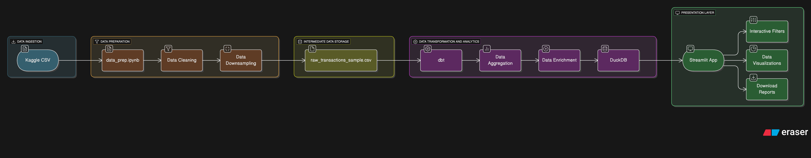

# 🧊 Snowfall Signal: Plaid-Inspired Fraud Detection

This project simulates a real-world fraud detection system inspired by Plaid. Using synthetic transaction data, i have built an end-to-end analytics pipeline that detects and visualizes fraud patterns.

---

## 🚀 Features

- Detect fraud using transaction patterns
- Risk-level classification (low, medium, high)
- dbt models for data transformation and enrichment
- Streamlit dashboard to visualize fraud rates and trends

---

## 🛠 Tech Stack

- **Python**
- **DuckDB** – fast in-process OLAP DB
- **dbt-duckdb** – data modeling & transformation
- **Streamlit** – interactive dashboard
- **pandas / plotly / matplotlib** – data analysis and visualization

---

## 📊 Dashboard Preview

Run locally or check out the live version below:

🌐 **Live Streamlit App**: [ashshashank-snowfall-signal.streamlit.app](https://ashshashank-snowfall-signal.streamlit.app)

The dashboard includes:
- 📈 Fraud Trend Over Time
- 🧠 Risk Band vs Fraud Rate
- 📋 Explore Sample Transactions

---

## 🧱 Setup Instructions

### 1. Clone the Repo

git clone https://github.com/Ashshashank/Snowfall-Signal.git
cd Snowfall-Signal

### 2. Create Virtual Environment

python3 -m venv snowfall_env
source snowfall_env/bin/activate

### 3. Install Dependencies

pip install -r requirements.txt
    (If you don’t have it yet:)
    pip install dbt-duckdb streamlit pandas plotly matplotlib duckdb

### 4. Build the Project

cd analytics
dbt seed --full-refresh
dbt run --full-refresh

### 5. Launch Dashboard

cd ../dashboard
streamlit run app.py

🤖 Author
Shashank Adepu
M.S. Computer Information Systems, Boston University
[LinkedIn](https://www.linkedin.com/in/shashank1ad/) | shashank1adepu@gmail.com

